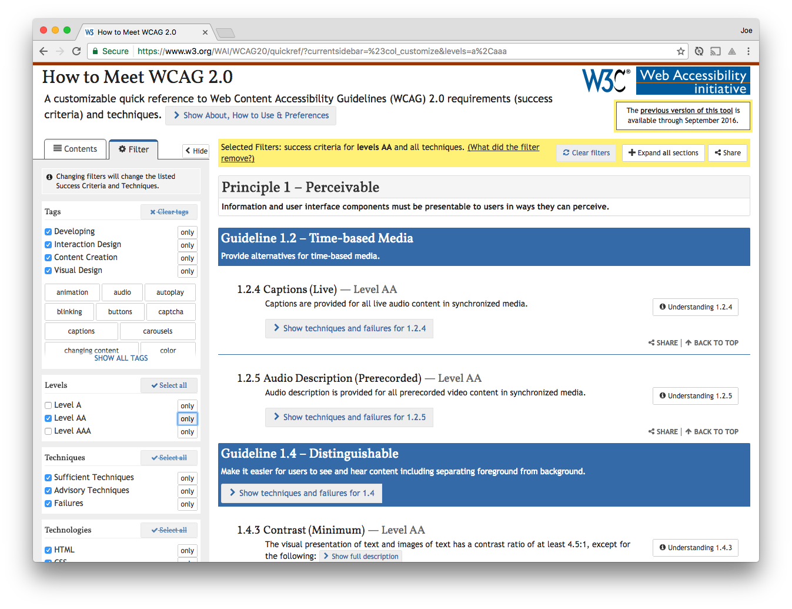
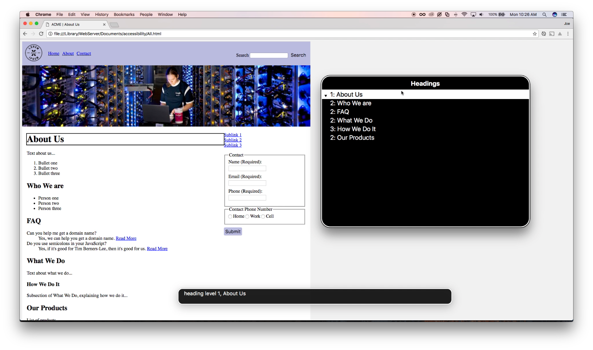
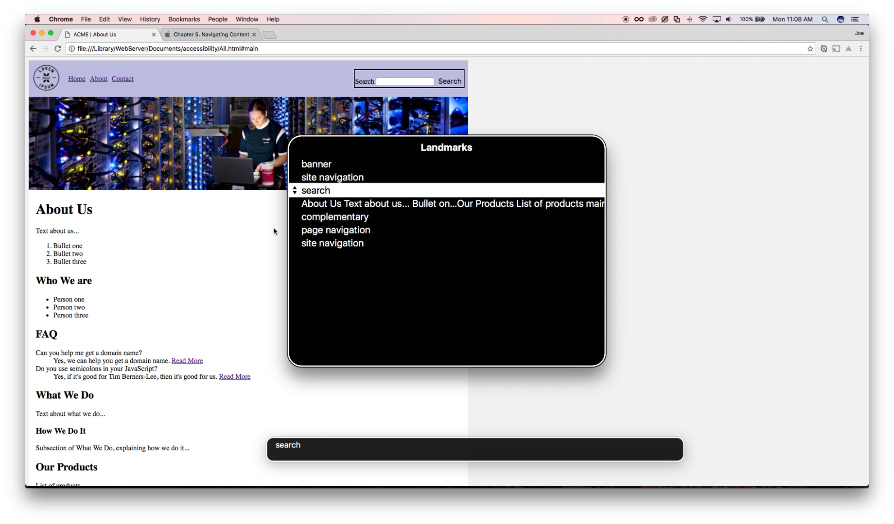
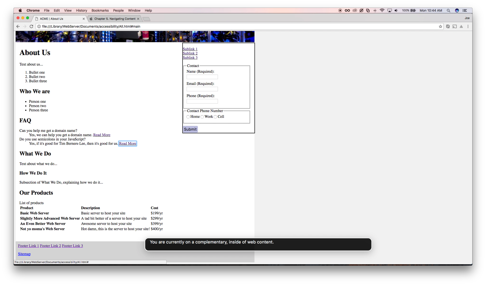
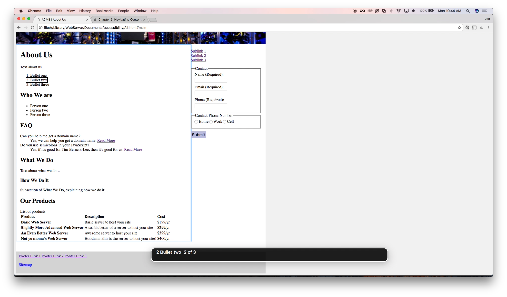
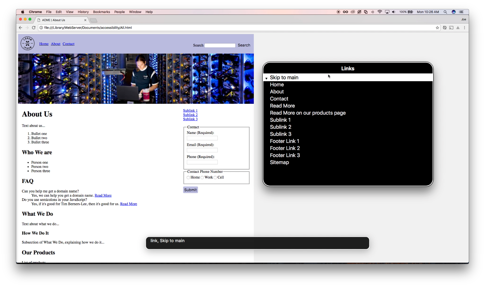
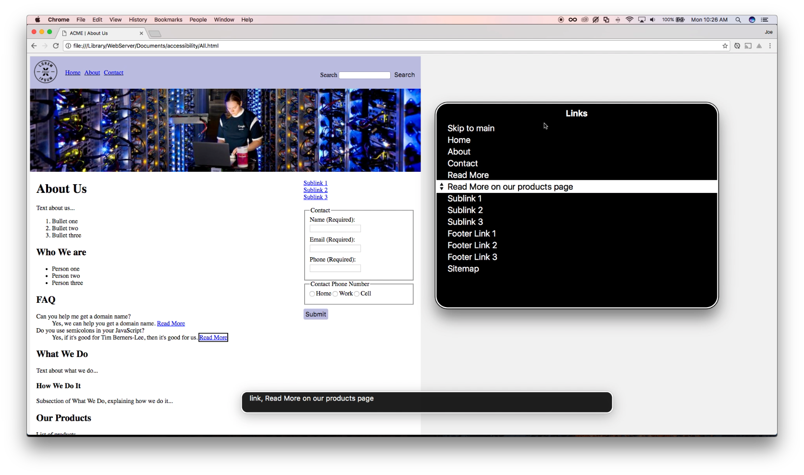
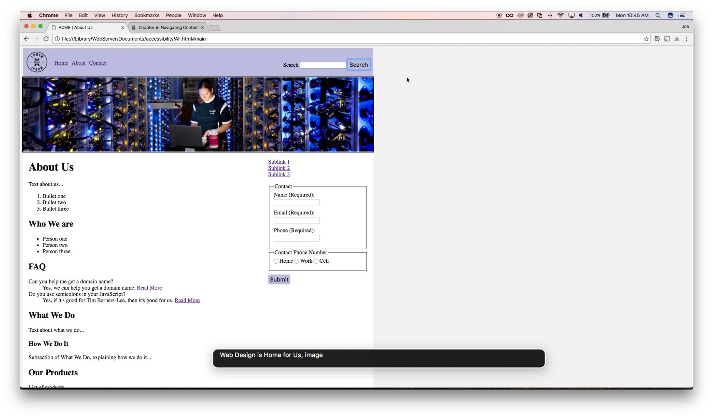
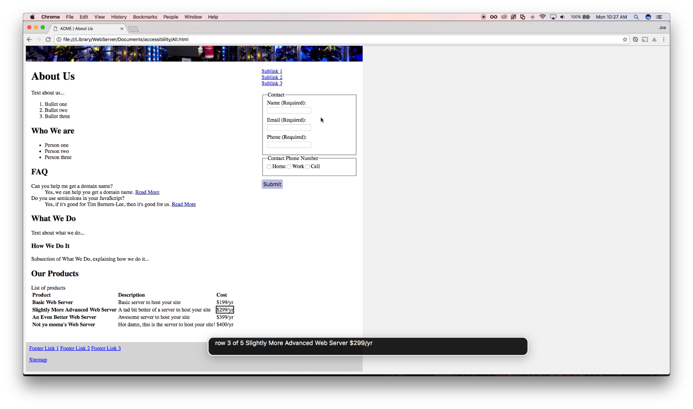

#Accessibility Presentation

##Accessibility Benefits:
Accessible to people with disabilities
Protection from discrimination lawsuits
Better SEO
Greater overall usability
Future proof yourself

##WCAG 2.0: Web Content Accessibility Guidelines
Published in 2008 - Global Accessibility Guidelines
State's that all content on a webpage should be:
* Perceivable
* Operable
* Understandable
* Robust

Meaning:
* Users must be able to perceive the information being presented, operate the interface, understand the information and access the content as technologies advance.

##Which to choose?
###WCAG 2.0 Level AA (meeting this guideline also covers all of Section 508)
WCAG Pros:
* 10 years newer
* Global acceptance

Each guideline has 3 levels of conformance: A, AA, AAA
* Level A: Most basic of web accessibility features
* Level AA: Biggest and most common barriers
* Level AAA: Highest level of accessibility



##How to Test a Screen Reader
Built into the OS: Mac & Windows

Voice Over:
* Start Voice Over
* Option + Control + Shift + Down Arrow 
* Then hit Right for each item until main content area



##Basic things to consider when developing
Lot's of stuff we already do as Frontenders...

###Document and Structure...
Landmarks



Checkpoint Level A 3.1.1 - Language of page
```html
<html lang="en">
```

Level AA 1.4.4 - Resize Text. 
Allows mobile users to pinch an zoom to increase readability.
```html
<meta name="viewport" content="width=device-width, initial-scale=1, maximum-scale=1, user-scale=no" />
```

Level A 1.4.1 - User should be able to increase text up to 200%
Use relative CSS units: rem or em.

Level A 1.3.1 - Info and Relationships
Chunck content into landmarks. Users with assistive technologies use this to navigate: 
header, nav, main, footer, aside. 
One ```<main>```, one ```<h1>``` per page.

###Lists
Level A 1.3.1 - Info and Relationships:
Use Lists: 
```html
<ol><ul><dl>
```
Benefits for screen readers:
Discoverable, Type of List, Total Items, Item Index



###Navigation and Skip Links
Level A 2.4.1 - Bypass Blocks: 
Add a Skip Link to main content
```html
<a class="skip-link" href="#main">Skip to main</a>...
<main id="main">
```


Level A 2.4.4 - Link Purpose:
```html
<a href="#">Read More <span class="visuallyHidden"> on our products page</span></a>
```


Level AA 2.4.5 - Muliple Ways 
Provide more than one way to locate a page on the site. Either via Search or a Sitemap.
```html
<form action="/search" method="POST" role="search">
```
"search" is a landmark role making it easy for screen readers.

###Forms
Do not zero out the CSS Outline property. Just use CSS to give it a better glow.

####Error Summary
Level AA 3.3.3 - Error Suggestion: 
Make a place where a summary of errors will be generated. Then create a list of links that navigate the user to those fields.
```html
<section id="errors" aria-live="assertive" tabindex="-1"></section>
```

Level A 1.4.1 - Use of Color: 
Color is not used as the only visual means of conveying information. 
Example: When a form errors, don't just put a red border on the fields that error. Say something as well.

10% of Men are Color Blind
75% of those are red/green deficient. They have a hard time distinguishing these colors from each other.
If we use Red to indicate invalid fields, and Green to indicate valid ones. Then, yeah...

####Inputs
Bad Practice:
```html
<input id="name" type="text" name="name" placeholder="Name" />
```

Good Practice:
Level A 4.1.2 - Name, Role, Value
```html
<label for="name" aria-live="assertive">
    Name (Required):
    <span class="error-message visuallyHidden">Name cannot be empty</span>
</label>
<input id="name" type="text" name="name" required aria-invalid="true" />
```

####Fieldsets
Bad Practice:
```html
<input type="radio" type="phone-type" name="home"> Home
<input type="radio" type="phone-type" name="home"> Work
```

Good Practice:
```html
<fieldset>
    <legend>Phone Number Type</legend><!--Legend is announced after every focused element for a screen reader-->
    <label><input type="radio" type="phone-type" name="home"> Home</label>
    <label><input type="radio" type="phone-type" name="work"> Work</label>
</fieldset>
```


###Media
Level A 1.1.1 - Non-text Content: 
All non-text content that is presented tot he user has a text alternative that serves the equivalent purpose.

Images: 
* Use real text instead of images.
* Screenreaders only show the file name of an image if no alt text is provided. 
* Omit the alt text value (alt="") if the image is just decoration.
* Don't describe image literally.
* Instead, describe the meaning or purpose of the image.

SVG: 
    Add ```role="img"```
    Use the ```<title>``` tag
    Use ```aria-labelledby``` referencing the title



###Tables
Use table grouping: thead, tfoot, tbody
Avoid complex tables: Not great experience for screen readers.


###RWD
Off screen content, meaning: left-100% is still focusable in the screenreader. To make it not focusable, make it display none. Just because you dont see it, doesnt mean that it on the screen reader.

##Resources:
* [Pluralsight - Meeting Web Accessibility Guidelines](https://app.pluralsight.com/library/courses/web-accessibility-meeting-guidelines/exercise-files)
* [WCAG 2: Quick Reference Guide](https://www.w3.org/WAI/WCAG20/quickref/?currentsidebar=%23col_customize)
* [Presentation Notes](https://github.com/jgeringer/accessibility/blob/master/PRESENTATION.md)
* [Video Demo - Voice Over](http://accessibility.paperplane.io/voice-over/voiceover-demo-final.mp4)
* [Web Demo - Web Design](http://accessibility.paperplane.io/Acme.html)
* [Web Demo - PiedPiper](http://accessibility.paperplane.io/PiedPiper.html)